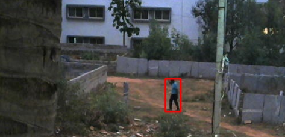
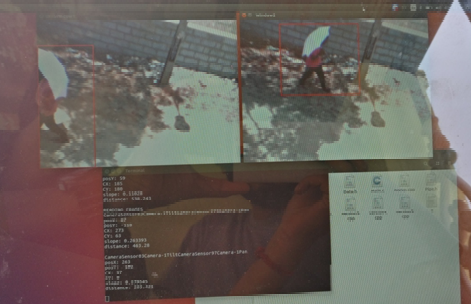

# Animal Intrusion Detection System
######  Note: This system proposed in 2017 is an end-to-end prototype of the actual idea.

#### Objective

   To detect an intrusion in a farm and to notify the relevant personnel with the live geographic location and the visuals of the intruder that provides the person to react in time and prevent any damage caused to the farm.

The proposed approach uses a set of motion sensors, whose count depends upon the area of the farm, which triggers the selective cameras when the sensors detect a motion of an animal or a human. The camera captures the visuals of the moving animal which and tracks the moving object into the farm. Additionally, it transmits the visuals to MQTT server for image processing to identify the object of intrusion. Once the moving object is identified to be an animal, the intruder (animal) along with it’s geographic location (WITHOUT EMPLOYING A GPS SENSOR) in the farm is sent from server to the output display that is developed over OpenGL library.

#### Architecture Diagram

#### Sequence Diagram

#### Advantages
The system is power efficient wherein, the cameras are triggered only when the sensors identify a motion within a farm.
This cost-efficient system is capable of efficiently capturing any intrusion irrespective of it’s location within the farm with limited, desired and calculated number of motion sensors and cameras.
It provides precise location of the object within the farm without usage of any GPS sensors.
It is based on (OpenCV) computer-vision, which helps in identifying an animal thereby disregarding tiny and harmless movements within the farm.
The system tracks the path of the animal intruding and also predicts the direction it would take next based on its previous steps.

#### Hardware

1.      NodeMCU – Microcontroller that has an inbuilt WIFI shield
2.      Motion Sensor – Doppler motion Sensor or any sensor that uses Infrared rays to detect motion
3.      Web Camera – To record and track the visuals that is compatible with the laptop

#### Software (tools/languages/libraries)

1.      Coding language – Embedded C
2.      Arduino IDE
3.      OpenGL and OpenCV
4.      Ubuntu OS to set up MQTT terminals

#### Sample visual capture

A camera of an average resolution placed at a height of 10 feet can detect and capture intrusion upto a horizontal distance of 40 feet.

